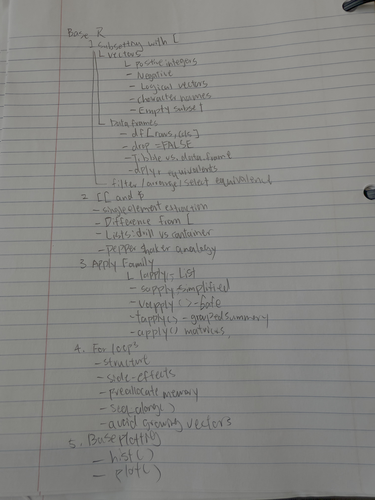
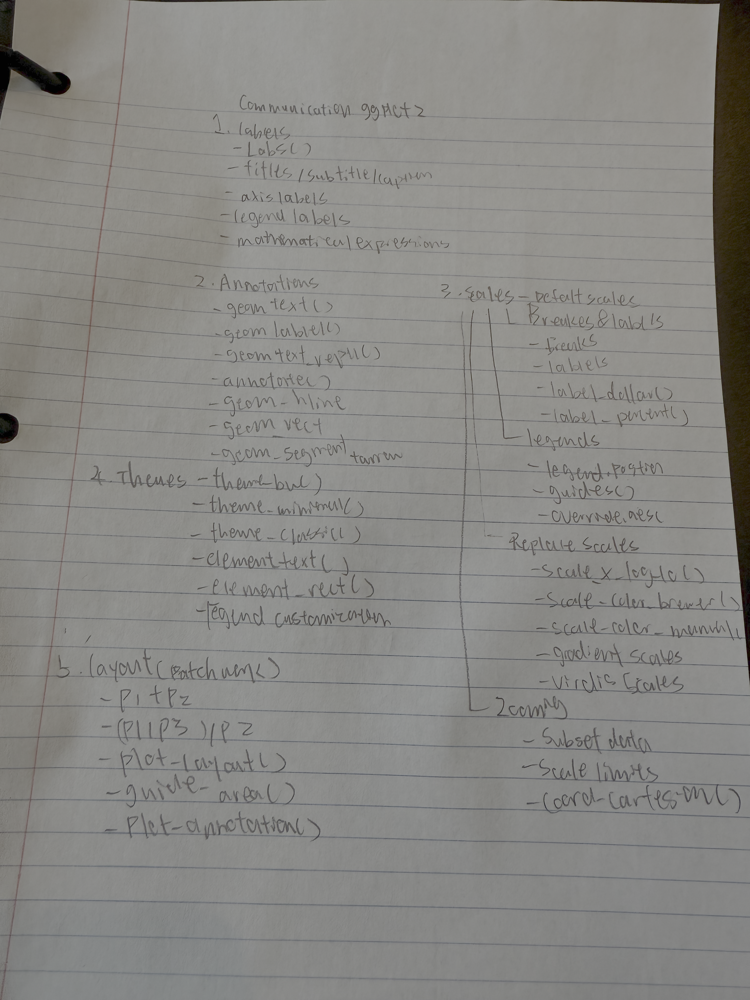
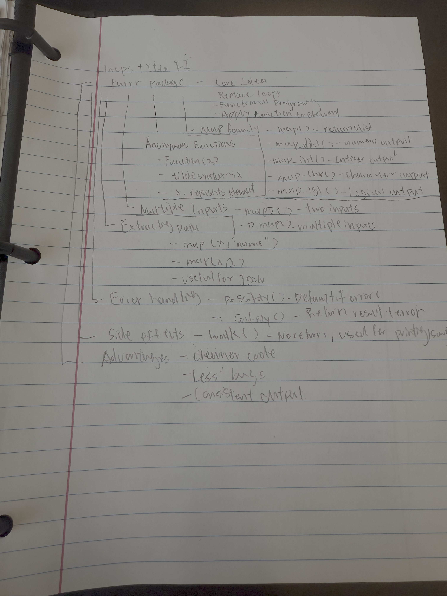
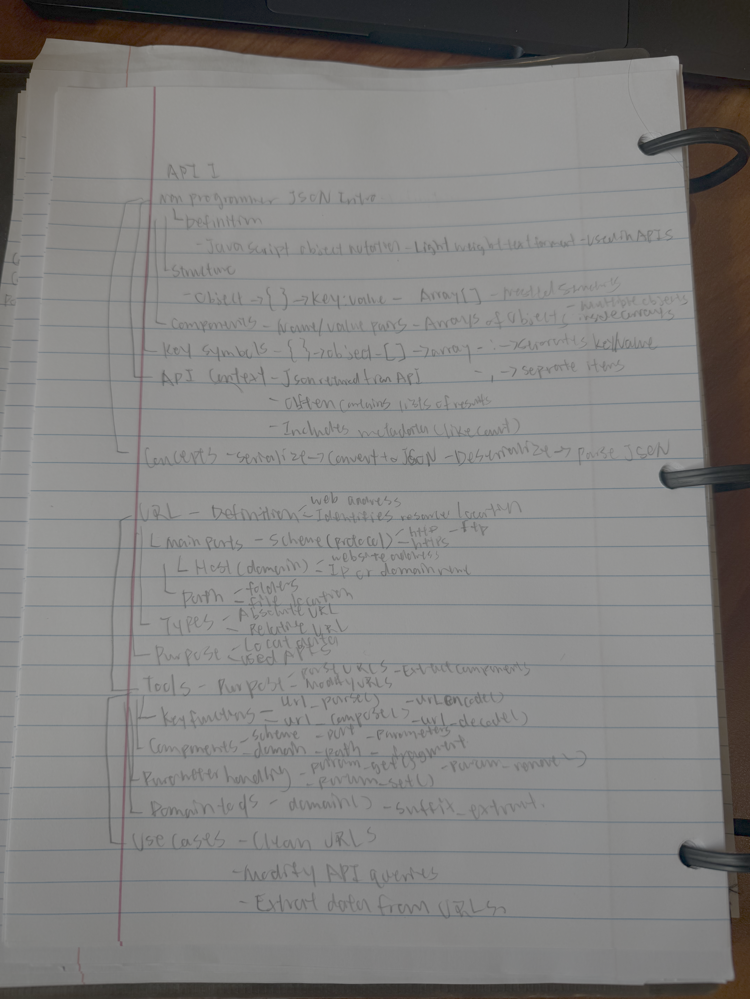
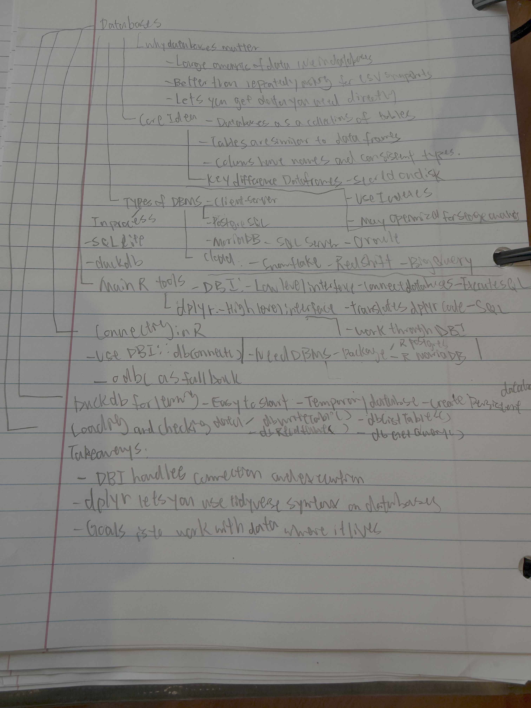
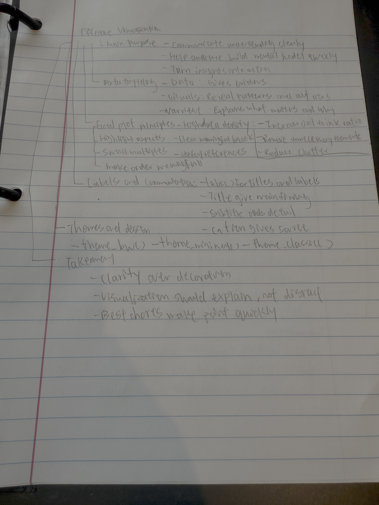
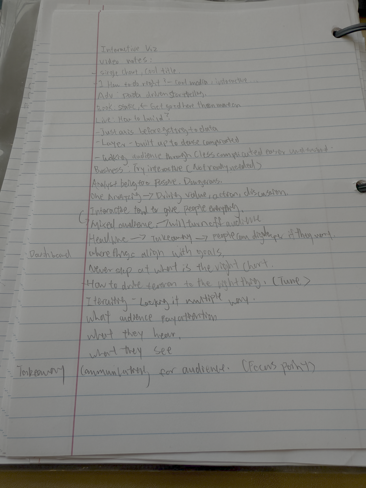

## Review

Appendix A: File Organization & Paths

This reading explained how to organize files in a data science project. I learned that projects should have clear folders such as code and data, and that raw data should never be changed. Instead, cleaned data should be stored separately, and scripts should document how the data was processed.

I also learned about file paths and the difference between absolute and relative paths. Relative paths are preferred because they work across different computers and make projects reproducible. Understanding file structure and paths is important for keeping projects organized and avoiding errors when reading files.

 Appendix B: Git and GitHub

This reading introduced Git and GitHub as tools for version control and collaboration. I learned that Git tracks changes in files through commits, while GitHub stores repositories online and allows multiple people to work together.

I also learned key concepts such as add, commit, push, and pull, which describe how changes are saved and shared. The reading explained merge conflicts and how they occur when two people edit the same part of a file. Understanding Git and GitHub is important for managing code and collaborating effectively on projects.

Appendix C: Keyboard Shortcuts

This reading covered keyboard shortcuts that improve efficiency when working in RStudio. I learned how to move the cursor, delete text, and highlight code using shortcuts instead of the mouse.

I also learned useful RStudio shortcuts such as inserting code chunks, running code, and using autocomplete. These shortcuts help speed up coding and make the workflow more efficient, especially when working on longer scripts or projects.

## Preclass learning 3 Adv Data Viz

## Preclass learning 4 Adv Spatial Viz

## Preclass learning 6 Adv Data wrangling I

## Preclass learning 7 Adv Data wrangling I

## Preclass learning 8 Missing Data

## Preclass learning 9 Functions

## Preclass learning 10 Base R

## Preclass learning 11 Loops + Iter I

## Preclass learning 12 Loops + Iter II

### Preclass learning 13 APIs I

## Preclass learning 14 APIs II

## Preclass learning 15 Web Scaping

## Preclass learning 16 Databases

## Preclass learning 17 Effective Viz

## Preclass learning 18 Interactive Viz

## Preclass learning 19 Quality Control 

- What is the data story?

The data story is about where happiness comes from in everyday life. The visualization uses responses from 10,000 people who described recent happy moments, then breaks those moments into who was involved, what action happened, and what the happiness was about. The main point is that happiness is not just one thing — it comes from different sources, especially from ourselves, other people, and pets, and often involves simple everyday experiences like meals, time together, gifts, hugs, jobs, or coming home.

- What is effective?

One thing that is effective is that the story has a clear structure. It starts with the big overview of “Moments of Happiness,” then breaks it into more specific sections like happiness with others and happiness with pets. That helps the reader move from the general pattern to more detailed examples. Another strong feature is the use of circle size to show frequency, so you can quickly tell which words or connections appear most often. The labeled example sentences also help make the abstract idea more understandable, because readers can connect the visualization back to real human experiences. Overall, the piece is interesting because it combines large-scale text analysis with a very human topic.

- What could be improved?

The main problem is that the visualization is very crowded and hard to read. There are too many circles, labels, and connecting lines on the main graphic, so it can feel overwhelming at first. Some of the text is also very small, which makes it difficult to interpret without zooming in. I think it would be improved by simplifying the display, reducing clutter, or highlighting only the most important relationships first. It might also help to use stronger color contrast or a more guided step-by-step explanation, because right now the graphic is visually interesting but not immediately easy to understand.
